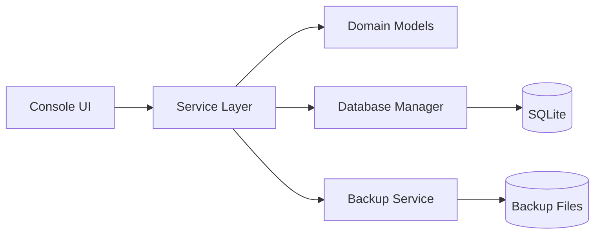
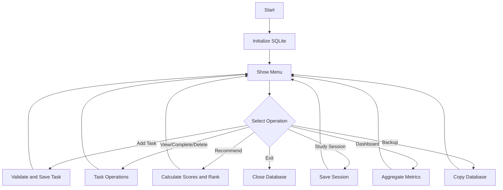
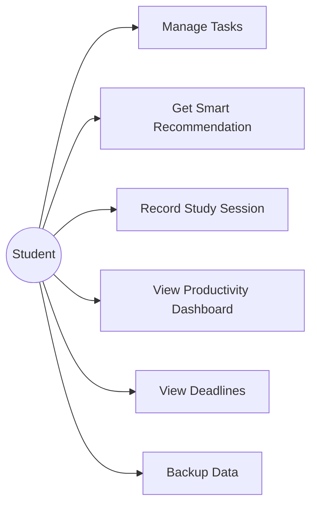
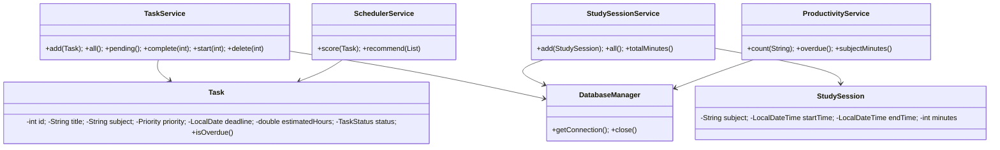
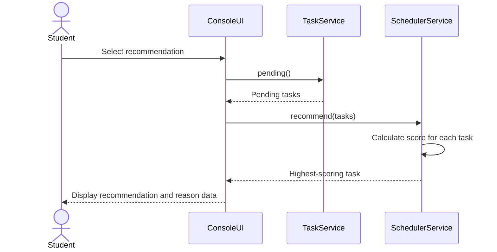
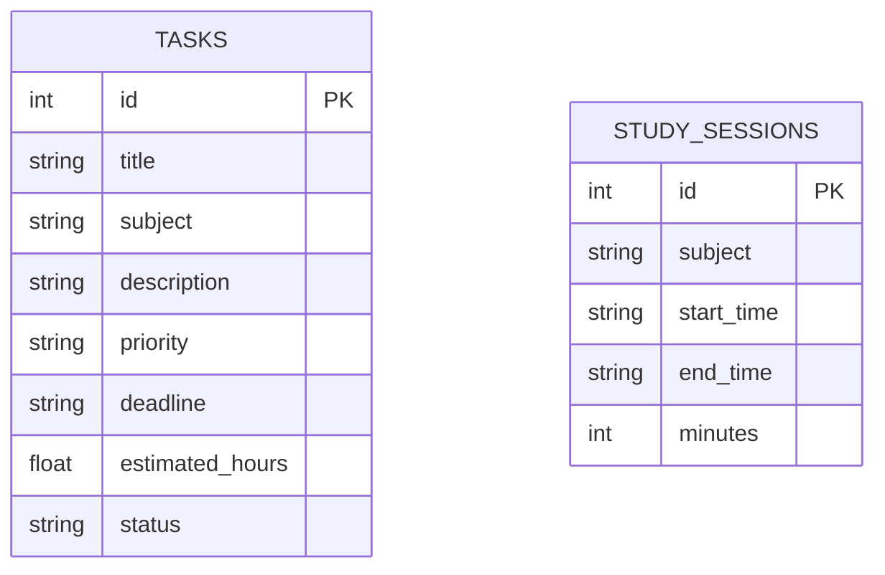

# Design Diagrams

## System Architecture

```mermaid
flowchart LR
UI[Console UI] --> S[Service Layer]
S --> M[Domain Models]
S --> D[Database Manager]
D --> DB[(SQLite)]
S --> B[Backup Service]
B --> FS[(Backup Files)]
```

## Workflow

```mermaid
flowchart TD
A[Start] --> B[Initialize SQLite]
B --> C[Show Menu]
C --> D{Select Operation}
D -->|Add Task| E[Validate and Save Task]
D -->|View/Complete/Delete| F[Task Operations]
D -->|Recommend| G[Calculate Scores and Rank]
D -->|Study Session| H[Save Session]
D -->|Dashboard| I[Aggregate Metrics]
D -->|Backup| J[Copy Database]
E --> C
F --> C
G --> C
H --> C
I --> C
J --> C
D -->|Exit| K[Close Database]
```

## Use Case

```mermaid
flowchart LR
Student((Student)) --> A[Manage Tasks]
Student --> B[Get Smart Recommendation]
Student --> C[Record Study Session]
Student --> D[View Productivity Dashboard]
Student --> E[View Deadlines]
Student --> F[Backup Data]
```

## Class Diagram

```mermaid
classDiagram
class Task { -int id; -String title; -String subject; -Priority priority; -LocalDate deadline; -double estimatedHours; -TaskStatus status; +isOverdue() }
class StudySession { -String subject; -LocalDateTime startTime; -LocalDateTime endTime; -int minutes }
class TaskService { +add(Task); +all(); +pending(); +complete(int); +start(int); +delete(int) }
class SchedulerService { +score(Task); +recommend(List) }
class StudySessionService { +add(StudySession); +all(); +totalMinutes() }
class ProductivityService { +count(String); +overdue(); +subjectMinutes() }
class DatabaseManager { +getConnection(); +close() }
TaskService --> Task
TaskService --> DatabaseManager
SchedulerService --> Task
StudySessionService --> StudySession
StudySessionService --> DatabaseManager
ProductivityService --> DatabaseManager
```

## Sequence: Smart Recommendation

```mermaid
sequenceDiagram
actor Student
participant UI as ConsoleUI
participant TS as TaskService
participant SS as SchedulerService
Student->>UI: Select recommendation
UI->>TS: pending()
TS-->>UI: Pending tasks
UI->>SS: recommend(tasks)
SS->>SS: Calculate score for each task
SS-->>UI: Highest-scoring task
UI-->>Student: Display recommendation and reason data
```

## Database / ER

```mermaid
erDiagram
TASKS {
 int id PK
 string title
 string subject
 string description
 string priority
 string deadline
 float estimated_hours
 string status
}
STUDY_SESSIONS {
 int id PK
 string subject
 string start_time
 string end_time
 int minutes
}
```
